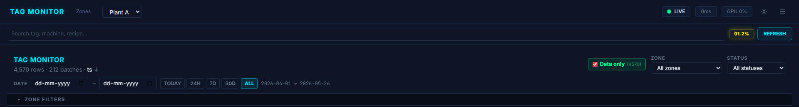
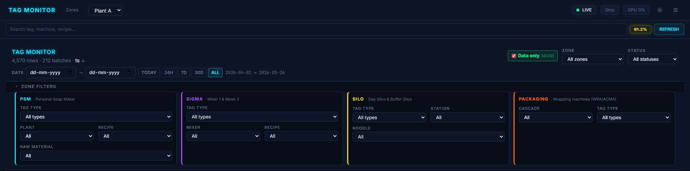
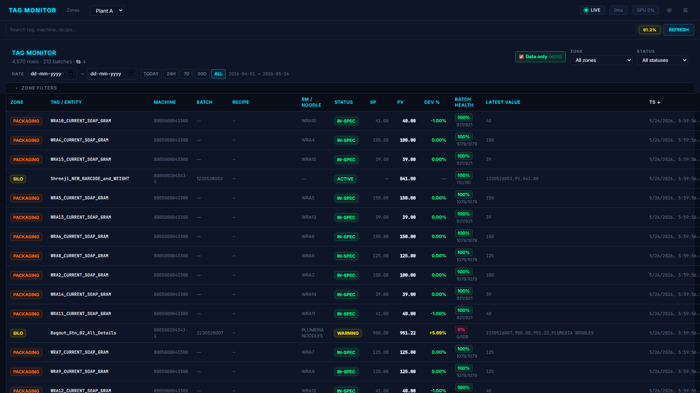
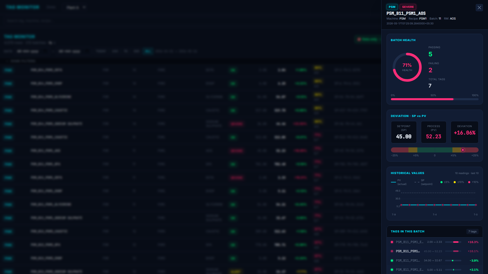
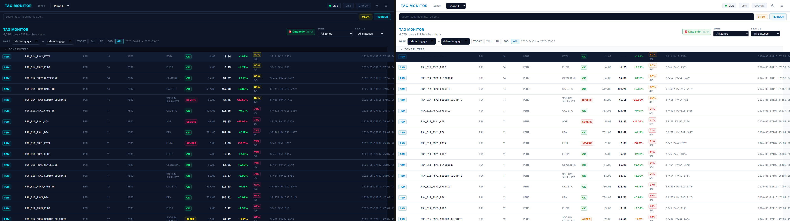

# TAG Health Monitor

### Real-time tag-quality and batch-health platform for LLPL Plant 1

---

**Prepared by:** Engineering Team
**Repository:** [github.com/Abhiramdadi17/tag-health](https://github.com/Abhiramdadi17/tag-health)
**Status:** Phase 1 — Internal preview (functional, locally hosted)
**Stack:** Angular 17 · .NET 8 · ONNX Runtime · ClosedXML

---

## 1. Executive Summary

TAG Health Monitor is an internal operations console that ingests OPC-UA telemetry from the LLPL soap-noodle line and surfaces, in a single view, **what every instrumented tag is doing right now and how trustworthy that signal is.** It replaces a manual, spreadsheet-driven inspection workflow with a typed, rule-validated dashboard backed by a predictive ML layer.

In its current state the system:

- Parses **four zones of equipment** (PSM dosing, Sigma mixers, day/buffer silos, packaging wrappers) from a unified schema.
- Applies **37 deterministic validation rules** across those zones, classified by severity (`CRITICAL` / `WARNING` / `INFO`).
- Computes a **per-batch health score** (passing rows ÷ rich-data rows) so operations leads can see at a glance which batches need scrutiny.
- Exposes a **single sortable table** of 4,500+ rows across 200+ batches with sticky filters for zone, status, date, raw material, recipe, plant, station, cascade, and wrapper.
- Ships an **ONNX-backed prediction layer** with five trained models (spike-within-5/10/15-minute windows, precursor-risk, future-error %, and a TFT attention model) that can be promoted to inline predictions next iteration.

The remainder of this document describes the data, the rules, the user interface, current implementation, and a concrete roadmap that lets us trade off depth (ML-driven foresight) versus breadth (more zones, more sites).

---

## 2. Problem Statement

Plant 1 streams several million telemetry rows per week across PSM, Sigma, Silo, and Packaging zones. Today, quality issues — bad weights, frozen sensors, recipe drift, silo cross-contamination — surface only when an operator notices a downstream defect, often **hours after the upstream event.** The existing review workflow is:

1. Pull last 24 h of `.xlsx` from the historian.
2. Filter by tag in Excel.
3. Eyeball deviations.

This is slow, inconsistent, and undetectable upstream. **The system we built moves that workflow from reactive spreadsheet review to a continuously-updating, rule-validated panel with an evidence trail per tag.**

---

## 3. Data Sources

All data originates from the OPC-UA edge gateway (`uaq-lakme-hul-iotedge-01`) on Site `LLPL`, Sensor `opcua`. We currently consume five workbooks served from the `data/` directory through the .NET backend:

| Workbook                                       | Rows           | Period            | Zone served       |
| ---------------------------------------------- | -------------- | ----------------- | ----------------- |
| `LLPL PSM 1st April to 20th May.xlsx`          | ~477 K         | Apr 1 → May 20    | PSM telemetry     |
| `PSM_TagData_10th_to_20th.xlsx`                | aggregated     | 10–20 May         | PSM RM-batch view |
| `LLPL SigmaMixer Zone.xlsx`                    | ~50 K          | Apr–May           | Sigma Mixer       |
| `LLPL Silo Zone.xlsx`                          | ~80 K          | Apr–May           | Silo              |
| `LLPL Packaging.xlsx`                          | ~120 K         | Apr–May           | Packaging         |

The common envelope of every row is the `RawTagRow` contract:

```ts
interface RawTagRow {
  IotDeviceId: string;   // 'uaq-lakme-hul-iotedge-01'
  SensorId: string;      // 'opcua'
  SiteId: string;        // 'LLPL'
  MachineId: string;
  Tag: string;
  Value: string | number;
  TS: string;            // '4/26/2026, 6:00:15.199 AM'
}
```

The backend (`ZoneTelemetryService`) lazy-loads each workbook the first time its zone is requested and serves it through `/zones/telemetry?zone=<key>&limit=<N>`. PSM RM-batch data goes through a separate `/tags` endpoint that returns pre-aggregated dosing records.

---

## 4. Tag Type Catalogue

Every Tag string is classified into one of four zones by `TagParserService.detectTagType()` based on substring matching. Each zone has sub-types with distinct payload formats.

### 4.1 PSM (Personal Soap Maker — dosing skid)

| Sub-type             | Tag pattern                          | Payload format                                                             |
| -------------------- | ------------------------------------ | -------------------------------------------------------------------------- |
| **RM-Batch dosing**  | `Psm_<plant>_<RM>_Batch`             | `D:202641,S:3,B:38,R:PLUMERIA NOODLES,RM:EDTA,SP:2.0499,PV:2.0850`        |
| **Batch PV weight**  | `PSM_<plant>_Batch_PV_Weight`        | scalar (kg)                                                                |
| **Batch SP weight**  | `PSM_<plant>_Batch_SP_Weight`        | scalar (kg)                                                                |
| **Batch counter**    | `PSM_<plant>_Batch_Counter`          | int                                                                        |
| **Noodle name**      | `PSM_<plant>_Noodle_Name`            | string (e.g. `JASMINE NOODLES`)                                            |

The `D:` field is a **Julian date** (YYYYDDD); `S:` is a status code (1 = idle, 2 = dosing, 3 = complete); `B:` is a 0–39 batch counter; `R:` is the recipe label; `RM:` is the raw material; `SP`/`PV` are setpoint and process value in kg.

**Raw materials currently tracked:** EDTA, EHDP, AOS, Salt, Water, Caustic, DFA, EMILY, GLYCERINE, Sodium Sulphate.

### 4.2 Sigma Mixer

| Sub-type    | Tag substring          | Payload                                                                 |
| ----------- | ---------------------- | ----------------------------------------------------------------------- |
| **Batch**   | `LAURIC_STRING`        | same `D/S/B/R/RM/SP/PV` schema as PSM, RM = "Lauric"                    |
| **Barcode** | `SM_MX*_BC` / `_BC`    | numeric barcode string, or literal `Scan Barcode` when idle              |
| **Rework**  | `REWORK`               | int (0 = normal, >0 = rework active)                                     |

Two mixers (`MX1`, `MX2`) are detected from substrings `MIXER_2` / `MX2` / `MX02`.

### 4.3 Silo

| Sub-type              | Tag substring          | Payload                                                                |
| --------------------- | ---------------------- | ---------------------------------------------------------------------- |
| **Noodle type**       | `type_of_noodle`       | one of the seven valid noodle types (or empty when silo is idle)       |
| **Bag-out detail**    | `All_Details`          | `batchId,SP,PV,noodleType` — single `,` means idle                     |
| **Station barcode**   | `Scnr_barcode`         | numeric (≥6 digits) when active                                        |
| **Warehouse barcode** | `Dosing_Barcode`       | `batchId,weight,noodleType,count`                                       |
| **Shreeji barcode**   | `Shreeji`              | `barcodeId,MODE,weight` (MODE is typically the literal `PV`)            |

Day silos 1–6 and Buffer silos 1–5 are surfaced separately. Station IDs are `Stn_01` / `Stn_02`.

### 4.4 Packaging

| Sub-type      | Tag                      | Payload                                                                |
| ------------- | ------------------------ | ---------------------------------------------------------------------- |
| **Wrapper**   | `WRA<n>` or `ACMA1`      | integer grams; target weight looked up from `WRAPPER_TARGETS` table    |

Cascades: `CAS3` (WRA2–9, ACMA1; targets 40–150 g) and `CAS5_6` (WRA10–16; targets 39–41 g). Default machine ID is `8005000043300`; three wrappers (WRA3, ACMA1, WRA16) have non-default machine IDs that are validated against `WRAPPER_MACHINE_MAP`.

### 4.5 Valid noodle types

`JASMINE NOODLES`, `PLUMERIA NOODLES`, `SERGIO 56 NOODLES`, `TEXAS MOD NOODLES`, `GALAXY NOODLES`, `20 PKO TULIP NOODLES`, `LILAC NOODLES`.

---

## 5. Tag Parsing Engine

`TagParserService` is a single-pass, dispatch-by-substring parser that turns a `RawTagRow` into a discriminated-union `ParsedTagValue`. Every downstream consumer (validator, table, drawer, ML feature engineer) only sees the parsed shape, never the raw cell. The key contract is:

```ts
type ParsedTagValue =
  | PsmParsed           // D,S,B,R,RM,SP,PV
  | PsmTelemetryParsed  // Batch_PV_Weight | Batch_SP_Weight | Batch_Counter | Noodle_Name
  | SigmaParsed         // same shape as PsmParsed
  | SigmaBarcode | SigmaRework
  | SiloParsed          // 5-way union for the silo sub-types
  | PackagingParsed     // wrapperName, cascade, currentGrams, targetGrams
  | UnknownParsed;
```

This is what makes the dashboard zone-agnostic: a row from any source comes out as a typed record that the unified table renders identically. Adding a new zone is a parser case + a status mapping; the table and drawer pick it up for free.

---

## 6. Validation Rules Catalogue

`TagValidationService` runs **37 rules** per tag. Every rule emits a `ValidationResult { ruleId, severity, passed, message }`. The dashboard's **batch health score** is computed solely from the `passed` flag on rows where `dataAvailable = true`.

### 6.1 General rules (apply to every tag)

| ID       | Severity | Description                                                                 |
| -------- | -------- | --------------------------------------------------------------------------- |
| GEN-01   | WARNING  | Streaming silence > 5 min during production hours (06:00–22:00 IST)         |
| GEN-02   | WARNING  | Null or empty value (idle bag-out exempted)                                 |
| GEN-03   | INFO     | Timestamps must be monotonically increasing per tag                         |
| GEN-04   | INFO     | Source metadata sanity (`SiteId=LLPL`, IotDeviceId, SensorId)               |

### 6.2 PSM rules

| ID       | Severity | Description                                                                     |
| -------- | -------- | ------------------------------------------------------------------------------- |
| PSM-01   | CRITICAL | Schema must contain all of D, S, B, R, RM, SP, PV                               |
| PSM-02   | CRITICAL | PV ≠ 0 while status = dosing (S=2)                                              |
| PSM-03   | CRITICAL | PV must not be negative                                                         |
| PSM-04   | WARNING  | PV must not drop > 0.5 kg within the same batch counter                         |
| PSM-05   | WARNING  | Completion deviation `|PV − SP|/SP` ≤ 5 % when S=3                             |
| PSM-06   | WARNING  | Status code must be 1, 2, or 3                                                  |
| PSM-07   | WARNING  | Batch counter sequential or 39→0 wrap                                           |
| PSM-08   | WARNING  | All RMs in current cycle agree on D and R                                       |
| PSM-09   | INFO     | Streaming gap inside production hours                                           |
| PSM-10   | INFO     | SP-change detection (event log only, never fails)                               |
| PSM-11   | INFO     | Julian date `D` must be within 2 days of system time                            |
| PSM-12   | INFO     | `Batch_PV_Weight` ≈ Σ RM PVs (≤ 2 % deviation)                                  |

### 6.3 Sigma rules (in addition to shared PSM rules for the batch sub-type)

| ID       | Severity | Description                                                                     |
| -------- | -------- | ------------------------------------------------------------------------------- |
| SMX-02   | CRITICAL | Barcode must be empty/idle marker, or pure numeric                              |
| SMX-03   | WARNING  | Rework value stuck > 0 for > 3 consecutive polls                                |
| SMX-04   | WARNING  | MX1 and MX2 must not be dosing the same batch counter simultaneously            |
| SMX-05   | INFO     | Recipe must not change mid-batch                                                |

### 6.4 Silo rules

| ID       | Severity | Description                                                                     |
| -------- | -------- | ------------------------------------------------------------------------------- |
| SLO-01   | CRITICAL | Noodle type must be in the valid set                                            |
| SLO-02   | CRITICAL | Bag-out detail must be CSV of 4 fields, or single `,` for idle                  |
| SLO-03   | CRITICAL | Bag PV weight ≥ 0                                                               |
| SLO-04   | WARNING  | Bag PV within 10 % of SP                                                        |
| SLO-05   | WARNING  | Day-silo and Buffer-silo of the same index must agree on noodle type            |
| SLO-06   | WARNING  | Station barcode format (≥ 6 digits) when active                                 |
| SLO-07   | WARNING  | Warehouse dosing barcode CSV valid (weight > 0, count 1–6, noodle in set)        |
| SLO-08   | INFO     | Silo streaming gap > 5 min (Shreeji exempt)                                     |
| SLO-09   | INFO     | If ≥6 silos report, no silo should be the lone source of a unique noodle type   |

### 6.5 Packaging rules

| ID       | Severity | Description                                                                     |
| -------- | -------- | ------------------------------------------------------------------------------- |
| PKG-01   | CRITICAL | Grams > 0                                                                       |
| PKG-02   | CRITICAL | `|grams − wrapper_target|` ≤ 3 g                                                |
| PKG-03   | WARNING  | No sudden jump > 5 g between polls                                              |
| PKG-04   | WARNING  | Same-target peers within cascade ≤ 3 g spread                                   |
| PKG-05   | WARNING  | MachineId matches `WRAPPER_MACHINE_MAP` expectation                             |
| PKG-06   | WARNING  | Value not frozen for > 5 identical consecutive polls                            |
| PKG-07   | INFO     | Wrapper gap > 6 min                                                             |

### 6.6 Status buckets

Raw statuses are bucketed for filtering and colouring:

| Bucket     | Underlying statuses                                                                       | Colour |
| ---------- | ----------------------------------------------------------------------------------------- | ------ |
| GOOD       | OK, NORMAL, COMPLETE, IN-SPEC, ACTIVE, SCANNED                                            | Green  |
| WARNING    | ALERT, WARNING, DOSING                                                                    | Yellow |
| CRITICAL   | SEVERE, CRITICAL, OUT-OF-SPEC, FROZEN, OFFLINE                                            | Pink   |
| IDLE       | IDLE                                                                                      | Muted  |

---

## 7. Batch Health Methodology

`ZoneAggregatorService.computeBatchHealth()` groups every row by a zone-specific `batchKey`:

- PSM: `PSM:<plant>:<batchId>:<recipe>`
- Sigma: `SIGMA:<mixer>:<batchCounter>`
- Silo: `SILO:<barcode>` if known, else `SILO:<siloId>` or `SILO:<stationId>`
- Packaging: `PACKAGING:<cascade>`

Score = `passing / total × 100`, but **only rows with `dataAvailable = true` count.** Idle barcodes, noodle-name labels, and zero-rework heartbeats don't penalise (or credit) the batch — only rule-applicable telemetry does. This stops the score from being diluted by inert label rows.

A score ≥ 95 % renders green; ≥ 80 % yellow; otherwise pink, with the underlying `passing / total` fraction tooltipped on hover.

---

## 8. Dashboard Walkthrough

The whole UI is one Angular page rendered around the `UnifiedTagsTableComponent`. The sticky header packages all of the discovery controls together so the user never loses context while scrolling 4,000+ rows.

### 8.1 Sticky title bar

> 

Row 1 carries the brand, the live row/batch count, the active sort indicator, the **Data only** toggle (count of rich rows), the **Zone** dropdown, and the **Status** dropdown. Row 2 is the **Date range** with TODAY / 24H / 7D / 30D / ALL presets anchored on the newest timestamp present in the data (so presets work on historical workbooks, not just "now"). Below that sits the collapsible **ZONE FILTERS** panel.

### 8.2 Zone filter cards (collapsible)

> 

Each zone gets its own column-filter card, colour-coded by zone identity (PSM cyan, Sigma purple, Silo yellow, Packaging orange). Cards only appear when the parent **Zone** dropdown includes them — so switching to Zone = SIGMA hides the other three cards. An "X active" counter and a **RESET ALL** button show in the header when any selection is non-default.

PSM card surfaces Tag Type, Plant, Recipe, Raw Material; Sigma surfaces Tag Type, Mixer, Recipe; Silo surfaces Tag Type, Station, Noodle; Packaging surfaces Cascade and Tag Type.

### 8.3 Unified table

> 

Thirteen columns: ZONE · TAG / ENTITY · MACHINE · BATCH · RECIPE · RM / NOODLE · STATUS · SP · PV · DEV % · BATCH HEALTH · LATEST VALUE · TS. Every header except LATEST VALUE is sortable; numeric/date columns toggle desc-first, text columns asc-first. Deviation % is colour-graded (≤ 5 % green, ≤ 10 % yellow, otherwise pink). Batch health renders as a coloured pill with the passing / total fraction beside it.

### 8.4 Tag detail drawer

> 

Clicking any row opens a fixed drawer containing the full payload, the parsed schema, the active rule failures (if any), and — for PSM rows — the last 10 PV readings rendered as a mini history chart. The drawer reads from the parent component's `allRows` signal, so cross-batch comparison is immediate.

### 8.5 Dark / light theming

> 

`ThemeService` exposes a signal-based palette consumed by every component. Switching theme re-evaluates every `[ngStyle]` binding without a route reload.

---

## 9. Predictive Layer (ONNX)

The `backend/Models/onnx/` directory ships six trained models behind `OnnxRiskPredictor`:

| Model                           | Purpose                                                              | Output            |
| ------------------------------- | -------------------------------------------------------------------- | ----------------- |
| `spike_5m.onnx`                 | P(weight-spike within 5 min)                                         | probability ∈[0,1]|
| `spike_10m.onnx`                | P(weight-spike within 10 min)                                        | probability       |
| `spike_15m.onnx`                | P(weight-spike within 15 min)                                        | probability       |
| `spike_within_window.onnx`      | P(spike anywhere in next 15 min)                                     | probability       |
| `precursor_risk.onnx`           | Probability that current window leads to a defective batch           | probability       |
| `future_error_pct.onnx`         | Regression: expected `|PV-SP|/SP` 5 min ahead                         | float             |
| `tft.onnx`                      | Temporal Fusion Transformer — attention weights for explainability    | tensor            |

The `RiskPredictorService` wraps these, and `FeatureEngineer` / `PythonFeatureEngineer` produce the rolling features (`pv_lag_*`, `sp_lag_*`, `dev_ewma_*`, `gap_seconds`, recipe one-hot, RM one-hot) consumed by the models. The models are reached from `/predict?tag=…&horizon=…` but **are not yet wired into the dashboard cells.** Promoting them to inline cells is the headline item on the next-iteration list.

---

## 10. What's Implemented Today

- [x] OPC-UA workbook loaders for PSM, PSM telemetry, Sigma, Silo, Packaging (`ZoneTelemetryService`, lazy + cached)
- [x] Strongly-typed parser for every tag sub-type (`TagParserService`)
- [x] 37 deterministic validation rules (`TagValidationService`)
- [x] Unified-row model with `dataAvailable` gating so the batch score isn't diluted by idle rows
- [x] `ZoneAggregatorService.computeBatchHealth()` (passing ÷ rich-total per batch key)
- [x] Single-page dashboard with sticky header (title · data-only · date · zone · status)
- [x] Collapsible per-zone column filters (PSM / SIGMA / SILO / PACKAGING)
- [x] Sortable, themed table with deviation gradient and health pills
- [x] Tag detail drawer with last-10 readings chart for PSM rows
- [x] Dark / light theme switcher
- [x] Six ONNX models present and load-tested in `OnnxRiskPredictor`
- [x] Date-range filtering with anchored presets (works on historical workbooks)
- [x] Repo + .gitignore + README

---

## 11. Roadmap — Next Iterations

### 11.1 Near-term (2-week sprint)

1. **Inline predictions in the table.** Render a "RISK 5m / 10m / 15m" mini-gauge per row sourced from the spike models. Hovering reveals the top three TFT-attention features driving the score. This is the single most impactful UI change: it converts the dashboard from "what is happening" to "what is about to happen."
2. **Alert log view.** A second tab that lists every failed rule chronologically, grouped by tag, with severity counts in the header. Required for shift handovers.
3. **Per-RM SP-range gauges.** `RM_SP_RANGES` is already defined in `types/tags.ts`; render a horizontal min/max band under each PSM row showing where the current SP sits inside the engineering range.
4. **CSV / XLSX export** of the current filtered view (one click → operations email).
5. **WebSocket push from the backend** so the table refreshes without polling once the historian is replaced by a live OPC-UA gateway.

### 11.2 Mid-term (1 quarter)

6. **Recipe-aware anomaly thresholds.** Today we use a flat ±5 % deviation threshold. Use the trained `future_error_pct` model to produce per-recipe, per-RM dynamic thresholds that tighten on stable recipes and widen on noisy ones.
7. **Batch lineage view.** Connect PSM → Sigma → Silo → Packaging by `batchId` and recipe and render a Sankey of how a single batch flows through the line, with rule failures and health scores rendered at each node.
8. **Operator annotations.** Let an operator click a failing row and attach a free-text reason (e.g. "RM bag mis-loaded — corrected at 14:12"). Annotations attach to the batch key and persist; they also become labels for retraining the ML models.
9. **Predictive-maintenance feed for Packaging.** PKG-06 (frozen value) already detects sensor sticking. Promote sticky-sensor events into a maintenance ticket queue (Jira / SAP PM).
10. **Multi-site support.** The `SiteId` is already enforced in `GEN-04`; generalise the loader to consume a registry of sites and surface site selection in the title bar.

### 11.3 Long-term (2–4 quarters)

11. **Closed-loop control suggestions.** When the spike-15m model predicts a defective batch with high confidence and the precursor model agrees, surface a concrete corrective action (e.g. "Reduce AOS SP by 0.4 kg") learnt from historical successful interventions.
12. **Cross-line comparison.** Once we have ≥ 2 sites streaming, surface a "league table" of OEE, recipe yield, and defect rate per shift across plants — the kind of view a plant head asks for in every weekly review.
13. **Mobile shop-floor view.** A read-only PWA build of the table view scoped to one machine, deployable on a wall-mounted tablet next to each cell.
14. **Native ingestion from MQTT / Kafka.** Replace `.xlsx` historian reads with a streaming source so latency drops from "load workbook → parse" (~3 s) to sub-100 ms.

---

## 12. Data Insights We Can Add

Beyond the operational dashboard, the dataset is rich enough to surface insights that are not in scope today but would be high-value reports for the project manager / plant head:

1. **Yield-per-recipe trendline.** Average `|PV−SP|/SP` per recipe across the last 30 days, ranked. Identifies the recipes that are hardest to dose accurately.
2. **RM contribution to defects.** For every CRITICAL rule failure on a batch, decompose which raw material's row failed. Shows whether (e.g.) Caustic dosing is the dominant cause of batch defects.
3. **Operator / shift heatmap.** Group rule failures by hour of day. Surfaces shift transitions, lunch dips, and pre/post-maintenance windows where the line is unstable.
4. **Wrapper-to-cascade efficiency.** Average grams-deviation per wrapper grouped by cascade. We already enforce `PKG-04`; this turns it into a chart that highlights long-term outlier wrappers for maintenance prioritisation.
5. **Silo cross-contamination probability.** Cross-tabulate `SLO-05` failures by silo-index. Output is a heatmap of which day/buffer pairs disagree most often — a direct input into the silo cleaning schedule.
6. **Comms reliability per device.** GEN-01 / PKG-07 / SLO-08 gap events grouped by `MachineId`. Identifies which OPC-UA endpoints are flaky and need an edge-gateway refresh.
7. **Batch-completion histogram.** Distribution of time-to-complete per recipe. Median + 95th-percentile = capacity baseline for production planning.
8. **Predictive-vs-actual ROC.** Plot the ROC curve of `spike_15m` against the labels actually emitted by the rule engine over the last 30 days. Monthly KPI for "is the ML still trustworthy."
9. **Recipe drift detection.** Use `psm10_spChangeDetection` (already in the rule engine but not yet visualised) to draw an SP-evolution chart per recipe. Detects when an engineer has been silently retuning the recipe without paperwork.
10. **Noodle-type purity audit.** For every batch, ratio of expected vs observed noodle types across the day silos that feed it. Adds a "purity %" column to the per-batch report — relevant for the customer audit pack.

---

## 13. KPIs the System Already Surfaces

These are the live numbers on the current dashboard; we can promote any of them to executive cards:

- Total rows monitored, total batches monitored
- Active filter health score (global, scoped to current view)
- Per-batch health score (with passing / total fraction)
- Active CRITICAL / WARNING / INFO count by zone
- Deviation distribution (green / yellow / pink banding on every numeric row)
- Date span of currently loaded data
- Per-RM, per-recipe, per-mixer, per-cascade row counts via the dropdowns

---

## 14. Technical Stack

| Layer            | Technology                                      | Notes                                                |
| ---------------- | ----------------------------------------------- | ---------------------------------------------------- |
| Frontend         | Angular 17, TypeScript 5, Tailwind CSS          | Standalone components, signal-based reactivity      |
| Frontend state   | Angular signals (no NgRx)                       | `signal`, `computed`, `input.required`, `output`     |
| Backend          | .NET 8 Minimal API                              | C# 12, async loaders, in-memory caching             |
| Data ingestion   | ClosedXML (workbook reader)                     | Streams `.xlsx` files from `data/`                   |
| ML runtime       | Microsoft.ML.OnnxRuntime                        | Loads 6 ONNX models on startup, single-row inference |
| Build / deploy   | `ng build` + `dotnet publish`                   | Currently localhost; container-ready                 |
| Repo             | Git on GitHub — `tag-health`                    | Branch: `master`                                     |

### Repository layout

```
tag-health/
├── README.md
├── .gitignore
├── frontend/                Angular 17 client
│   └── src/app/
│       ├── components/zones/unified-tags-table/
│       ├── components/zones/tag-detail-drawer/
│       ├── pages/zones/zones-dashboard.component.{ts,html}
│       ├── services/{tag-parser, tag-validation, zone-aggregator,
│       │              zone-tags, zone-telemetry, theme}.service.ts
│       └── types/tags.ts        // canonical type contracts
├── backend/                 .NET 8 minimal API
│   ├── Program.cs
│   ├── Models/{TagRecord, Prediction}.cs
│   ├── Services/{TagLoader, ZoneTelemetry, FeatureEngineer,
│   │              OnnxRiskPredictor, RiskPredictor,
│   │              TftAttention}.cs
│   └── Models/onnx/             // ONNX artefacts
└── data/                    Source workbooks (5 files)
```

---

## 15. Risks & Mitigations

| Risk                                                                      | Likelihood | Mitigation                                                                                   |
| ------------------------------------------------------------------------- | ---------- | --------------------------------------------------------------------------------------------- |
| Historian schema changes break parser substring detection                 | Medium     | Parser is centralised; one file changes. Add a smoke test asserting at least one row per zone parses.         |
| ML models drift as recipes change                                         | High       | Add the predictive-vs-actual ROC report (item 8 in §12); retrain monthly.                     |
| Workbook loading > 5 s on large files                                     | Medium     | Already cached per-zone after first load; long-term move to streaming ingestion.              |
| User-action attribution is impossible without operator annotations        | High       | Operator annotations (§11.2 item 8) close this gap.                                           |

---

## 16. Closing

The platform converts a reactive Excel workflow into a proactive, rule-validated, ML-augmented operations view. Phase 1 is complete and demonstrable; the immediate next move is to surface the existing ONNX predictions inline and to ship the alert-log tab so the system can replace the daily review meeting rather than supplement it.

Demonstration is available locally — backend on `localhost:5050`, frontend on `localhost:4200`. The repository at [github.com/Abhiramdadi17/tag-health](https://github.com/Abhiramdadi17/tag-health) contains everything required to reproduce the build.

---

### Appendix A — Screenshot capture checklist

Place captures into `docs/screenshots/` matching these filenames so the report renders without editing:

- `01-title-bar.png` — full sticky header, both rows visible, ZONE FILTERS collapsed
- `02-zone-filters.png` — ZONE FILTERS expanded, all four cards visible
- `03-unified-table.png` — mid-page view of the table with at least one CRITICAL row and one passing row visible, sorted by `ts ↓`
- `04-tag-drawer.png` — drawer open on a PSM RM row showing the last-10 history sparkline
- `05-theme.png` — split capture of dark + light theme side by side

### Appendix B — Quick start

```bash
# Backend
cd backend
dotnet run                # listens on http://localhost:5050

# Frontend (new terminal)
cd frontend
npm install
npm start                 # serves http://localhost:4200
```

---

*Document generated against repository commit on master. Update the version footer here when promoting changes that affect rules, models, or dashboard layout.*
